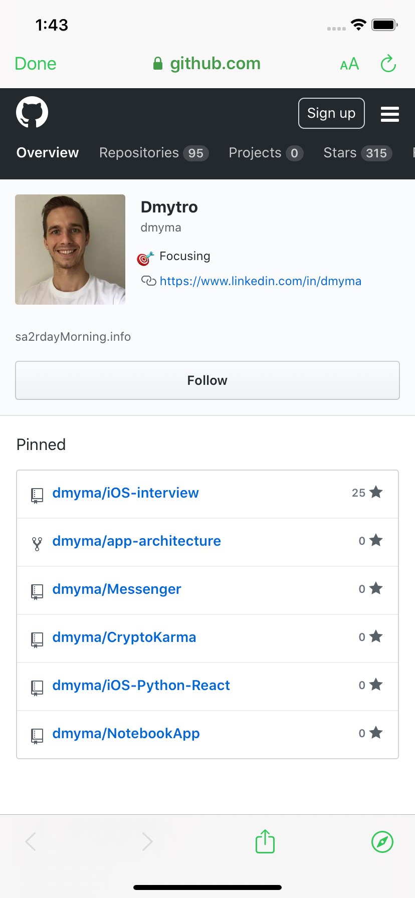

# GITHUBBER
Keep track of your and your followers repositories, followings and followers.
No Storyboard. Completely programtic using UIkit and no dependency managers
iPhone8+

# resource:
- Github API

# features: 
- UI Dark Mode setup
- Tabview
- embedded navigation views 
- modular child views

# skills:
- Delegation data passing
- Data modeling
- Codable
- collectionview 
- tableview
- REST
- Pagination
- Threading
- emptystate handling
- active loading view
- core animation
- retain cycle prevention

